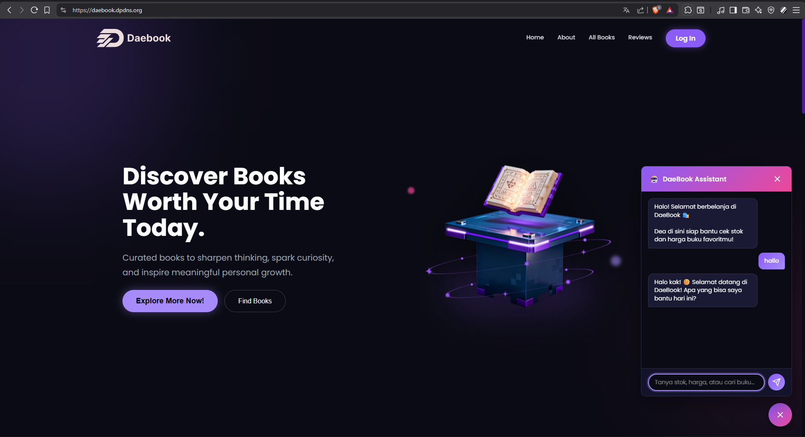

# POS Toko Buku (Daebook)

Sistem Point of Sale (POS) untuk toko buku yang dibangun dengan PHP dan MySQL. Aplikasi ini mencakup fitur manajemen buku, penjualan, pembelian, stok, dan dilengkapi dengan AI Assistant menggunakan Groq API.

## 📚 Preview Aplikasi


*Tampilan landing page aplikasi POS Daebook*

## 📋 Daftar Isi
- [Fitur Utama](#-fitur-utama)
- [Persyaratan Sistem](#-persyaratan-sistem)
- [Instalasi Step by Step](#-instalasi-step-by-step)
- [Menjalankan Aplikasi](#-menjalankan-aplikasi)
- [Setup Server AI (Opsional)](#-setup-server-ai-opsional)
- [Panduan Penggunaan](#-panduan-penggunaan)
- [Troubleshooting](#-troubleshooting)

## 🚀 Fitur Utama

- **Autentikasi & Role-based Access**: 3 level akses (Admin, Kasir, Gudang)
- **Manajemen Buku**: CRUD buku lengkap dengan upload cover
- **Point of Sale (POS)**: Transaksi penjualan dengan cetak struk
- **Manajemen Pembelian**: Input pembelian dari supplier dan penerimaan barang
- **Manajemen Stok**: Monitoring dan penyesuaian stok
- **Manajemen Kategori & Penerbit**: Organisasi buku
- **Manajemen Customer**: Database pelanggan
- **Laporan**: Laporan penjualan dan pembelian
- **AI Assistant**: Chatbot untuk rekomendasi buku (menggunakan Groq API)

## 💻 Persyaratan Sistem

### Untuk Aplikasi Web (Wajib)
- **PHP**: Versi 7.4 atau lebih baru
- **MySQL/MariaDB**: Database server
- **Web Server**: Salah satu dari:
  - Laragon (Rekomendasi untuk Windows)
  - XAMPP
  - WAMP
  - Atau PHP Built-in Server untuk testing

### Untuk AI Assistant (Opsional)
- **Node.js**: Versi 18 atau lebih baru
- **npm**: Package manager (biasanya sudah include dengan Node.js)
- **Groq API Key**: Gratis, daftar di [console.groq.com](https://console.groq.com)

## 📦 Instalasi Step by Step

### Langkah 1: Persiapan Folder Project

1. **Download atau Clone Repository**
   - Jika menggunakan Git:
     ```bash
     git clone https://github.com/ryzecl/pos_tokobuku.git
     ```
   - Jika download ZIP: Extract file ZIP ke folder `pos_tokobuku`

2. **Pindahkan ke Web Root**
   
   **Untuk Laragon:**
   ```
   Pindahkan folder 'pos_tokobuku' ke: C:\laragon\www\
   Hasilnya: C:\laragon\www\pos_tokobuku\
   ```
   
   **Untuk XAMPP:**
   ```
   Pindahkan folder 'pos_tokobuku' ke: C:\xampp\htdocs\
   Hasilnya: C:\xampp\htdocs\pos_tokobuku\
   ```

### Langkah 2: Setup Database

#### Opsi A: Menggunakan phpMyAdmin (Lebih Mudah)

1. **Buka phpMyAdmin**
   - Laragon: Klik kanan icon Laragon di tray → Database → phpMyAdmin
   - XAMPP: Buka browser, akses `http://localhost/phpmyadmin`

2. **Buat Database Baru**
   - Klik tab "Databases"
   - Ketik nama database: `pos_daebook`
   - Klik tombol "Create"

3. **Import File SQL**
   - Klik database `pos_daebook` yang baru dibuat
   - Klik tab "Import"
   - Klik tombol "Choose File"
   - Pilih file: `C:\laragon\www\pos_tokobuku\database\pos_daebook.sql`
   - Scroll ke bawah, klik tombol "Import"
   - Tunggu hingga muncul pesan sukses

#### Opsi B: Menggunakan Command Line

1. **Buka Terminal/Command Prompt**
   - Laragon: Klik kanan icon Laragon → Terminal
   - Atau buka PowerShell/CMD biasa

2. **Jalankan Perintah Import**
   ```bash
   # Masuk ke folder database
   cd C:\laragon\www\pos_tokobuku\database
   
   # Import database (tanpa password)
   mysql -u root -p < pos_daebook.sql
   ```
   
   **Catatan:** 
   - Jika diminta password, tekan Enter saja (default Laragon tanpa password)
   - Untuk XAMPP, password default biasanya juga kosong

### Langkah 3: Konfigurasi Koneksi Database

1. **Buka File Konfigurasi**
   - Buka file: `config\database.php` dengan text editor

2. **Periksa/Sesuaikan Setting Database**
   
   File `config\database.php` sudah dikonfigurasi dengan default berikut:
   ```php
   private $host = 'localhost';
   private $db_name = 'pos_daebook';
   private $username = 'root';
   private $password = '';
   ```

3. **Sesuaikan Jika Perlu**
   
   **Untuk Laragon (Default):**
   - Biasanya tidak perlu diubah, sudah sesuai

   **Untuk XAMPP:**
   - Biasanya tidak perlu diubah
   
   **Jika Menggunakan Password MySQL:**
   - Ubah `private $password = '';` menjadi `private $password = 'password_anda';`

### Langkah 4: Verifikasi Folder Upload

1. **Pastikan Folder Upload Ada dan Writable**
   
   Folder untuk upload cover buku harus ada dan memiliki permission yang tepat:
   ```
   C:\laragon\www\pos_tokobuku\assets\produk\
   ```

2. **Jika Folder Belum Ada, Buat Manual:**
   - Buka folder `C:\laragon\www\pos_tokobuku\assets\`
   - Buat folder baru bernama `produk`

## ▶️ Menjalankan Aplikasi

### Metode 1: Menggunakan Laragon (Rekomendasi)

1. **Start Laragon**
   - Buka aplikasi Laragon
   - Klik tombol "Start All"
   - Tunggu hingga Apache dan MySQL berwarna hijau

2. **Buka Browser**
   - Ketik di address bar: `http://localhost/pos_tokobuku`
   - Atau: `http://pos_tokobuku.test` (jika menggunakan virtual host Laragon)

### Metode 2: Menggunakan XAMPP

1. **Start XAMPP**
   - Buka XAMPP Control Panel
   - Klik "Start" pada Apache
   - Klik "Start" pada MySQL
   - Tunggu hingga kedua service running

2. **Buka Browser**
   - Ketik di address bar: `http://localhost/pos_tokobuku`

### Metode 3: Menggunakan PHP Built-in Server (Testing)

1. **Buka Terminal**
   - Buka PowerShell atau CMD
   - Masuk ke folder project:
     ```bash
     cd C:\laragon\www\pos_tokobuku
     ```

2. **Jalankan Server**
   ```bash
   php -S localhost:8000
   ```

3. **Buka Browser**
   - Ketik di address bar: `http://localhost:8000`

## 🔐 Login Pertama Kali

Setelah instalasi berhasil, gunakan kredensial default:

| Role | Username | Password |
|------|----------|----------|
| Admin | admin | password |
| Kasir | kasir | password |
| Gudang | gudang | password |

**⚠️ PENTING:** Segera ganti password default setelah login pertama kali melalui menu Pengaturan → Users!

## 🤖 Setup Server AI (Opsional)

Fitur AI Assistant memerlukan server Node.js terpisah. Ikuti langkah berikut jika ingin mengaktifkan fitur ini.

### Langkah 1: Install Node.js

1. **Download Node.js**
   - Kunjungi: https://nodejs.org
   - Download versi LTS (Long Term Support)
   - Install dengan klik Next-Next-Finish

2. **Verifikasi Instalasi**
   ```bash
   node --version
   npm --version
   ```
   Kedua perintah di atas harus menampilkan versi yang terinstall.

### Langkah 2: Daftar Groq API Key

1. **Buat Akun Groq**
   - Kunjungi: https://console.groq.com
   - Sign up dengan email atau Google account
   - Verifikasi email jika diminta

2. **Generate API Key**
   - Setelah login, buka menu "API Keys"
   - Klik "Create API Key"
   - Beri nama, misal: "POS DaeBook"
   - Copy API Key yang muncul (simpan baik-baik, tidak akan ditampilkan lagi)

### Langkah 3: Setup Environment Variables

1. **Buat File .env**
   - Buka folder: `C:\laragon\www\pos_tokobuku\server\`
   - Buat file baru bernama: `.env` (dengan titik di depan)
   
   **Tips membuat file .env di Windows:**
   - Buka Notepad
   - Simpan file dengan nama: `.env` (dengan tanda kutip)
   - Atau gunakan text editor seperti VS Code, Notepad++

2. **Isi File .env**
   ```env
   GROQ_API_KEY=gsk_xxxxxxxxxxxxxxxxxxxxxxxxxxxxxxxxxxxxxxxxxxxxxxxx
   CACHE_REFRESH_SECRET=rahasia-saya-123
   ```
   
   **Keterangan:**
   - `GROQ_API_KEY`: Paste API key yang sudah di-copy dari console.groq.com
   - `CACHE_REFRESH_SECRET`: Buat password rahasia sendiri (untuk keamanan endpoint refresh cache)

### Langkah 4: Install Dependencies

1. **Buka Terminal di Folder Server**
   ```bash
   cd C:\laragon\www\pos_tokobuku\server
   ```

2. **Install Package**
   ```bash
   npm install
   ```
   
   **Catatan:** Proses ini akan download semua library yang dibutuhkan. Tunggu hingga selesai (bisa 1-2 menit).

### Langkah 5: Jalankan Server AI

1. **Start Server**
   
   **Untuk Development (dengan auto-restart):**
   ```bash
   npm run dev
   ```
   
   **Untuk Production:**
   ```bash
   npm start
   ```

2. **Verifikasi Server Berjalan**
   - Buka browser, akses: `http://localhost:3000`
   - Jika berhasil, akan muncul pesan: `{"message":"Groq REST API server is running"}`

3. **Biarkan Terminal Tetap Terbuka**
   - Server harus tetap berjalan selama Anda menggunakan fitur AI
   - Untuk stop server, tekan `Ctrl+C` di terminal

### Langkah 6: Test AI Assistant

1. **Buka Aplikasi POS**
   - Login ke aplikasi: `http://localhost/pos_tokobuku`

2. **Buka Chat Assistant**
   - Klik icon chat di pojok kanan bawah
   - Ketik pesan, misal: "Rekomendasi buku untuk anak-anak"
   - Tunggu response dari AI

**Jika AI tidak merespon, cek:**
- Apakah server Node.js masih running di terminal?
- Apakah GROQ_API_KEY sudah benar di file .env?
- Apakah ada error di terminal server?

## 📖 Panduan Penggunaan

### 1. Menambah Buku Baru

1. Login sebagai Admin atau Gudang
2. Klik menu "Buku" di sidebar
3. Klik tombol "Tambah Buku"
4. Isi form:
   - Judul, Pengarang, Penerbit
   - ISBN, Tahun Terbit
   - Kategori
   - Harga Beli & Harga Jual
   - Upload cover buku (opsional)
5. Klik "Simpan"

### 2. Input Pembelian dari Supplier

1. Login sebagai Admin atau Gudang
2. Klik menu "Pembelian"
3. Klik "Tambah Pembelian"
4. Pilih buku dan masukkan jumlah
5. Status akan "Pending" → klik "Terima Barang" untuk menambah stok

### 3. Transaksi Penjualan (POS)

1. Login sebagai Admin atau Kasir
2. Klik menu "Penjualan" atau "POS"
3. Pilih customer (atau buat baru)
4. Scan barcode atau pilih buku manual
5. Tentukan jumlah
6. Pilih metode pembayaran (Tunai/Debit/Kredit)
7. Input jumlah bayar
8. Klik "Proses Transaksi"
9. Cetak struk jika diperlukan

### 4. Lihat Laporan

1. Login sebagai Admin
2. Klik menu "Laporan Penjualan" atau "Laporan Pembelian"
3. Pilih tanggal awal dan akhir
4. Klik "Tampilkan"
5. Export ke Excel jika diperlukan

### 5. Manajemen User

1. Login sebagai Admin
2. Klik menu "Users"
3. Tambah/Edit/Hapus user
4. Atur role (Admin/Kasir/Gudang) sesuai kebutuhan

## 🔧 Troubleshooting

### Masalah: Tidak bisa akses http://localhost/pos_tokobuku

**Solusi:**
1. Pastikan Apache/web server sudah running
2. Cek apakah folder sudah benar di webroot
3. Coba akses `http://localhost` dulu untuk memastikan server hidup
4. Periksa log error di Laragon/XAMPP

### Masalah: Error "Database connection gagal"

**Solusi:**
1. Pastikan MySQL sudah running (cek di Laragon/XAMPP)
2. Periksa file `config/database.php`:
   - Apakah nama database sudah benar? (`pos_daebook`)
   - Apakah username/password sudah sesuai?
3. Pastikan database sudah di-import
4. Test koneksi MySQL via phpMyAdmin

### Masalah: Upload cover buku error

**Solusi:**
1. Pastikan folder `assets/produk/` ada
2. Cek permission folder (harus writable)
3. Cek ukuran file (maks 2MB)
4. Format file harus: JPG, JPEG, PNG, atau GIF

### Masalah: Server AI tidak jalan / npm install error

**Solusi:**
1. Pastikan Node.js sudah terinstall: `node --version`
2. Hapus folder `node_modules` dan file `package-lock.json`
3. Jalankan ulang: `npm install`
4. Periksa file `.env` apakah format sudah benar
5. Pastikan tidak ada spasi sebelum/sesudah `=` di file `.env`

### Masalah: Chat AI tidak merespon

**Solusi:**
1. Pastikan server Node.js running (cek terminal)
2. Cek GROQ_API_KEY di file `.env` (salin ulang dari console.groq.com)
3. Buka `http://localhost:3000` untuk cek server status
4. Periksa console browser (F12) untuk error
5. Pastikan tidak ada firewall yang memblokir port 3000

### Masalah: Login tidak bisa / "Invalid credentials"

**Solusi:**
1. Pastikan database sudah di-import dengan benar
2. Cek tabel `users` di phpMyAdmin apakah ada data
3. Gunakan kredensial default:
   - Username: `admin`
   - Password: `admin123`
4. Pastikan tidak ada spasi saat mengetik username/password

## 📁 Struktur Folder Project

```
pos_tokobuku/
├── assets/
│   ├── css/              # File CSS
│   ├── js/               # File JavaScript
│   └── produk/           # Upload cover buku
├── components/
│   ├── chat.php          # Komponen chat AI
│   └── sidebar.php       # Komponen sidebar menu
├── config/
│   ├── config.php        # Konfigurasi umum & session
│   └── database.php      # Koneksi database PDO
├── database/
│   └── pos_daebook.sql   # File SQL untuk import
├── models/               # Model untuk akses database
│   ├── Buku.php
│   ├── Penjualan.php
│   ├── Pembelian.php
│   ├── Customer.php
│   ├── User.php
│   └── ...
├── server/               # Server Node.js untuk AI
│   ├── server.js         # Main server file
│   ├── package.json      # Dependencies
│   └── .env              # Environment variables (dibuat manual)
├── index.php             # Halaman utama (katalog buku)
├── login.php             # Halaman login
├── dashboard.php         # Dashboard admin
├── buku.php              # Manajemen buku
├── penjualan.php         # Halaman POS
├── pembelian.php         # Manajemen pembelian
├── stok.php              # Monitoring stok
└── README.md             # File dokumentasi ini
```

## 🔒 Keamanan

### Rekomendasi untuk Production:

1. **Ganti semua password default**
   - Password user admin, kasir, gudang
   - Password database MySQL

2. **Aktifkan HTTPS**
   - Gunakan SSL certificate
   - Redirect semua HTTP ke HTTPS

3. **Jangan ekspos server AI ke internet**
   - Server Node.js hanya untuk localhost
   - Jika perlu akses remote, gunakan reverse proxy (Nginx/Apache)
   - Tambahkan autentikasi tambahan

4. **Backup database secara berkala**
   - Export database via phpMyAdmin
   - Atau gunakan mysqldump via command line

5. **Simpan kredensial dengan aman**
   - Jangan commit file `.env` ke Git
   - File `.gitignore` sudah include `.env`

## 📝 Catatan Tambahan

- **Role Admin**: Akses penuh ke semua fitur
- **Role Kasir**: Fokus pada penjualan dan customer
- **Role Gudang**: Fokus pada stok, pembelian, dan buku

- Untuk pertanyaan atau issue, silakan buat issue di repository
- Aplikasi ini dibuat untuk keperluan pembelajaran dan bisa dikembangkan lebih lanjut

## 📄 Lisensi

Project ini bersifat open source untuk keperluan pembelajaran.

---

**Selamat menggunakan POS Daebook! 📚**

Jika ada pertanyaan atau kendala, jangan ragu untuk bertanya atau membuka issue di repository.
